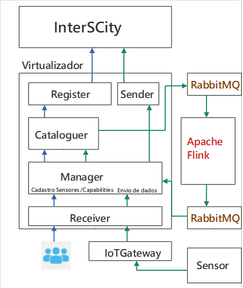

# IoTVirtualizer

O objetivo do IoTVirtualizer é realizar o processamento de capabilities complexas para a InterSCity(INCT) a partir de um conjunto de sensores reais, anteriormente cadastrados na plataforma. A partir do trabalho em https://github.com/rafaelsilvabr/IoTVirtualizer foram feitas modificações para introduzir uma conexão com o software RabbitMQ que faz o envio de dados para o framework Apache Flink, onde são processados.

## Componentes IoTVirtualizer
<br>

• Receiver: Implementa a camada responsável por receber os dados e traduzir as
requisições para os métodos internos, pode assumir uma interface REST ou Pub-
Sub;

• Manager: Orquestra as operações internas do Virtualizer, é responsável pelo
fluxo de envio de mensagens, cadastro de novos recursos e operações/capabilities
do Virtualizer, e recebe os dados processados do Flink;

• Cataloguer: É responsável pelos dados dos recursos virtuais e definições de
operações/capabilities do IoTVirtualizer. Realiza o envio de dados pelo RabbitMQ;

• Register: Realiza o registro do recurso virtual na plataforma INCT e retorna o uuid de cadastro;

• Sender: Envia os dados processados à plataforma INCT.

## Fluxo de Mensagem (Implementação Atual)


Cadastro Virtual Resource

- [RECEIVER] A mensagem é recebida pelo Receiver através de interface REST;

- [MANAGER] Manager encaminha o novo cadastro ao cataloguer;

- [REGISTER] <span style="color: yellow"> Realiza o cadastro do Recurso Virtual na INCT, busca o endereço do Gateway dos sensores reais na INCT e realiza o cadastro nos IoT Gateways; </span>

Cadastro Capability

- [RECEIVER] A mensagem é recebida pelo Receiver através de interface REST;

- [MANAGER] Manager encaminha o novo cadastro ao cataloguer;

-  [REGISTER] <span style="color: yellow"> Realiza o cadastro da nova Capability na INCT; </span>

Envio Dado
- [RECEIVER] A mensagem é recebida pelo Receiver através de interface REST ou Pub-Sub;

- [CATALOGUER] Envia os dados pelo RabbitMQ para processamento no Apache Flink;

- [MANAGER] Recebe os dados processados pelo Flink do RabbitMQ.

- [SENDER] <span style="color: yellow"> Envia o dado processado à INCT. </span>


## Data Template: 

### Exemplo dado p/registro de um Recurso Virtual

O registro de um Recurso Virtual possui os seguintes dados:

Data: Para Virtual Resources, seguimos os padrões de dados de registro da INCT. Contém os dados necessários para cadastro de um recurso na plataforma.

Capabilities: As capabilities as quais o sensor está associado.

Exemplo:

>PUT: /resources

```json
# Registro de um novo recurso Virtual
  "data": {
    "description": "Virtual Sensor",
    "capabilities": [
      "temperatureByDistrict"
    ],
    "status": "active",
    "lat": -23.559616,
    "lon": -46.731386
  },
```

### Exemplo dado p/registro de uma Capability

Name: Nome da Capability

Description: Uma descrição da capability <span style="color: gray"> (Info necessária para o registro na INCT) </span>

Capability Type: O tipo da Capability.

Exemplo:

>PUT: /capabilities

```json
# Registro de uma nova Capability
{
	"name": "temperatureByDistrict",
	"description": "Average temperature of a district",
	"capability_type": "sensor"
}                                           
```

